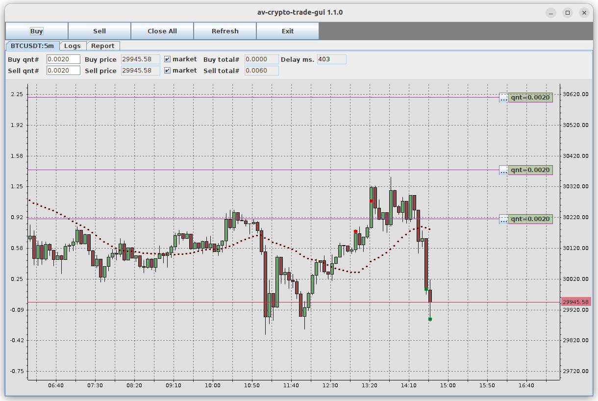
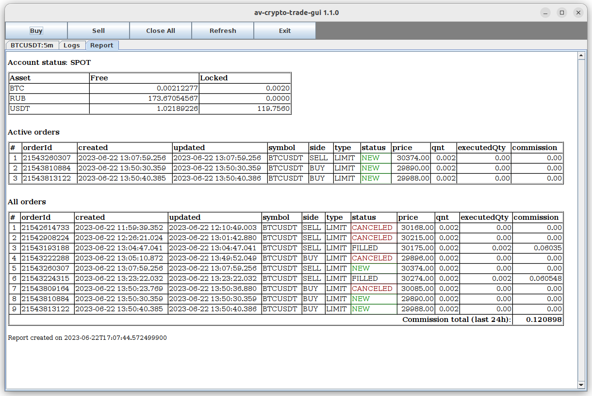

# av-bitcoin-trade-gui

Java trade GUI client for bitcoin trade

## Features
- Support creating limit orders on the chart (drag red runner and press Spacebar)
- Support display and canceling limit orders on the chart
- Displays fired order on the chart
- ZMQ API for displaying custom elements on chart
- Simple API for integrating any trade platform
- Supports binance-connector-java for binance clients
- This software can be used to visualize trading bot orders.

## How to start
- Configure java environment (install java jdk-17 or higher)
  - export JAVA_HOME=/opt/jdk-20.0.1
  - export PATH=$JAVA_HOME/bin:$PATH
- Run ./mvn-install.sh for building jar files from sources
- Configure av-bitcoin-binance.yaml and run ./av-bitcoin-binance.sh
- Check trade REST API http://localhost:8089 
- Configure av-bitcoin-trade-gui.yaml and run ./av-bitcoin-trade-gui.sh

Chart panel

Report panel

