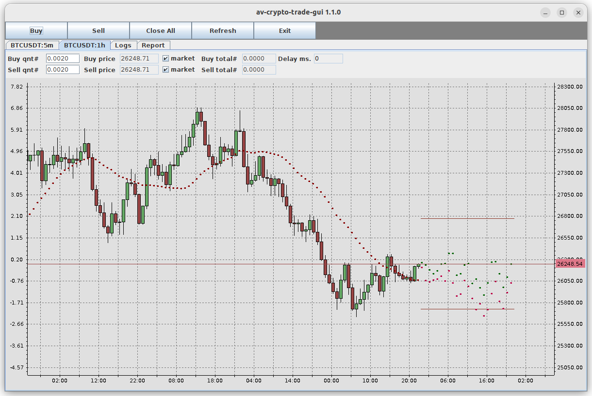

# av-bitcoin-trade-gui

Linux GUI client for bitcoin trading, supports Binance API

## Features
- Creation of limit orders by clicking on the chart (just drag a red slider and press the spacebar)
- Creation or cancellation of  orders from the chart directly
- Display of completed orders on the chart
- ZMQ API for displaying custom elements on the chart (points, lines)
- Simple API for integrating into any trade platform
- Binance-api support (used binance-connector-java)
- This software can be used for orders visualization in auto trading

## How to start

### Build project
- Configure java environment (install java jdk-17 or higher)
  - export JAVA_HOME=/opt/jdk-17.0.2
  - export PATH=$JAVA_HOME/bin:$PATH
- Run ./mvn-build.sh for creating jar files from sources

### Start quote proxy server
- Configure av-bitcoin-emulator.yaml and run ./av-bitcoin-emulator.sh 
  Emulator generates random bitcoin quotes, that are used for local GUI client testing

or 
- Configure av-bitcoin-binance.yaml and run ./av-bitcoin-binance.sh 
  This app uses binance-connector-java for data exchange

### Start GUI client
- Check proxy server REST API http://localhost:8089
- Configure av-bitcoin-trade-gui.yaml and run ./av-bitcoin-trade-gui.sh

Chart panel:

Display of advice points on the chart:

Report panel:

